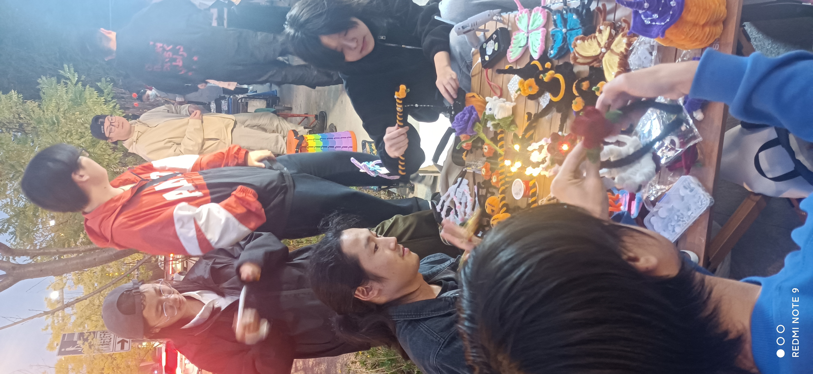

---
# You can also start simply with 'default'
theme: excali-slide
# random image from a curated Unsplash collection by Anthony
# like them? see https://unsplash.com/collections/94734566/slidev
background: https://cover.sli.dev
# some information about your slides (markdown enabled)
title: 超级俱乐部！
info: |
  ## 超级俱乐部！！！！！

# apply unocss classes to the current slide
class: text-center
# https://sli.dev/features/drawing
drawings:
  persist: false
# slide transition: https://sli.dev/guide/animations.html#slide-transitions
transition: slide-left
# enable MDC Syntax: https://sli.dev/features/mdc
mdc: true
# take snapshot for each slide in the overview
overviewSnapshots: true
dragPos:
  square: 168,146,175,155
---

# 超级俱乐部


<div class="pt-12 flex justify-end">
  

  <span @click="$slidev.nav.next" class="px-2 py-1 rounded cursor-pointer" flex="~ justify-center items-center gap-2" hover="bg-white bg-opacity-10">
    我们在干嘛 <div class="i-carbon:arrow-right inline-block"/>
  </span>
</div>

<div class="abs-br m-6 flex gap-2">
  <button @click="$slidev.nav.openInEditor()" title="Open in Editor" class="text-xl slidev-icon-btn opacity-50 !border-none !hover:text-white">
    <div class="i-carbon:edit" />
  </button>
</div>

<!--
The last comment block of each slide will be treated as slide notes. It will be visible and editable in Presenter Mode along with the slide. [Read more in the docs](https://sli.dev/guide/syntax.html#notes)
-->

---
transition: fade-out
layout: image-right

# the image source
image: /assets/club_main.jpg
---

# 超级俱乐部?


  超级俱乐部以健康的`生活方式`为目标，

- 🤝 **去原子化的** - 远离`原子化`个体的生活
- ☘ **健康的** - 而非~~消费的~~/~~享乐的~~/~~虚无的~~
  
  <br>
  活动内容：

- 🕮 - `共享`知识经验
- 🚚 - 实践青年`创业`
- ∩ - 为`会员`提供`线下`社交娱乐、学习交流、健康咨询、饮食建议等服务

<br>

活动场所: `成都青年之家1号`旗舰店


<!--
You can have `style` tag in markdown to override the style for the current page.
Learn more: https://sli.dev/features/slide-scope-style
-->

<style>
h1 {
  background-color: #2B90B6;
  background-image: linear-gradient(45deg, #4EC5D4 10%, #146b8c 20%);
  background-size: 100%;
  -webkit-background-clip: text;
  -moz-background-clip: text;
  -webkit-text-fill-color: transparent;
  -moz-text-fill-color: transparent;
}
</style>


---
layout: two-cols
---
# 🕮 经验分享

  超级俱乐部以健康的`生活方式`为目标，

- 🤝 **去原子化的** - 远离`原子化`个体的生活
- ☘ **健康的** - 而非~~消费~~、~~享乐~~、~~虚无~~
  
  <br>
  活动内容：

``` md {0}
 > 🕮 - 共享知识经验  

```
- 🚚 - 实践青年`创业`
- ∩ - 为`会员`提供`线下`社交娱乐、学习交流、健康咨询、饮食建议等服务

<br>

活动场所: `成都青年之家1号`旗舰店

::right::
<div class="h-120 overflow-y-scroll flex flex-wrap">
  
  
  
  
  
  
  
  
  
  
</div>

---
layout: two-cols
---
# 🚚青年创业

  超级俱乐部以健康的`生活方式`为目标，

- 🤝 **去原子化的** - 远离`原子化`个体的生活
- ☘ **健康的** - 而非~~消费~~、~~享乐~~、~~虚无~~
  
  <br>
  活动内容：

- 🕮 - 共享知识经验  
``` md {0}
 > 🚚 - 实践青年`创业`
```
- ∩ - 为`会员`提供`线下`社交娱乐、学习交流、健康咨询、饮食建议等服务

<br>

活动场所: `成都青年之家1号`旗舰店

::right::
<div class="h-120 overflow-y-scroll flex flex-wrap">
  <h5>> 开发组实况</h5>
  
  
  
  <h5>> 文创组实况</h5>
  
  
  
  
  
  <h5>> 工程组实况</h5>
  
  
  <h5>> 比赛组实况</h5>
  
  
</div>

---
layout: two-cols
---
# ∩ 会员生活

  超级俱乐部以健康的`生活方式`为目标，

- 🤝 **去原子化的** - 远离`原子化`个体的生活
- ☘ **健康的** - 而非~~消费~~、~~享乐~~、~~虚无~~
  
  <br>
  活动内容：

- 🕮 - 共享知识经验  

- 🚚 - 实践青年`创业`
``` md {0}
 > ∩ - 为*会员*提供*线下*社交娱乐、学习交流、健康咨询、饮食建议等服务
```

<br>

活动场所: `成都青年之家1号`旗舰店

::right::
<div class="h-120 overflow-y-scroll flex flex-wrap">
  
  
  
  
  
  
  
  
  
  
  
  
  
  
  
</div>


---
layout: center
class: text-center
dragPos:
  square: 355,312,46,48
---

# 了解更多


</img>
</img>

<br>


- [青年之家1号店-青聚锦官城](https://cdyouth.cdcyl.org.cn/jgc/) 
- [b站账号](https://space.bilibili.com/589409046) 
- [俱乐部主站](https://ismist.cn/#s8)

- 技术交流群
</img>


<PoweredBySlidev mt-10 />
